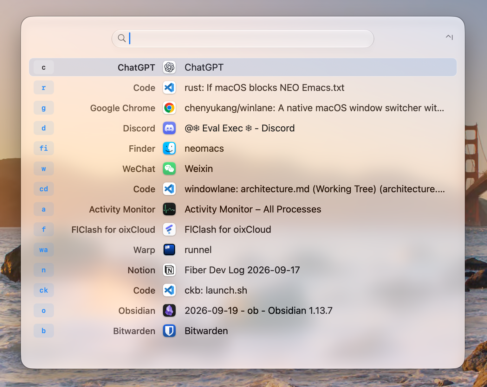
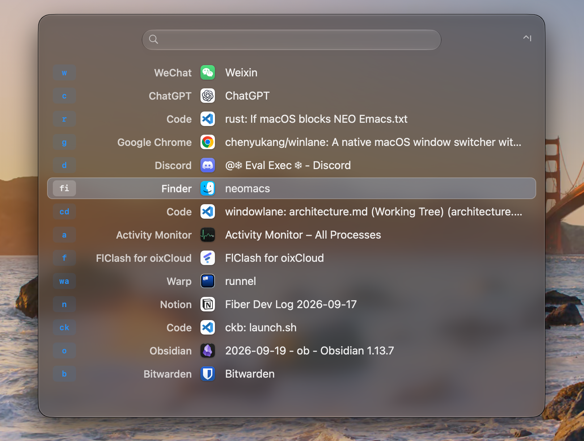

# Winlane

Switch windows, launch apps, and handle everyday Mac tasks from your keyboard.

Winlane combines a window switcher with search for apps, saved links, snippets, clipboard history, files, and recent projects. It lives in the menu bar and opens when you need it.

| Light mode | Dark mode |
| --- | --- |
|  |  |

[Install](#install) · [Get started](#get-started) · [Everyday tools](#everyday-tools) · [Customize](#customize) · [Privacy](#privacy-and-permissions)

## Install

Requires **macOS 14 or later**. Builds are available for Apple Silicon and Intel Macs.

1. Download a DMG or ZIP from [GitHub Releases](https://github.com/chenyukang/winlane/releases/latest). Choose **arm64** for Apple Silicon or **x86_64** for Intel.
2. Move **Winlane.app** to **Applications** and open it.
3. Allow Winlane in **System Settings → Privacy & Security → Accessibility** so it can find and switch windows. On macOS 27, this permission is called **Device Control and Data Access**.
4. Press **Control + I** to open search, or hold **Command** and press **Tab** to switch windows.

If macOS blocks a release marked **not notarized**, verify that you downloaded it from this repository, then use **System Settings → Privacy & Security → Open Anyway**. The release page includes its signing status and checksums.

Release builds check for updates daily and ask before downloading and installing. You can also choose **Check for Updates…** from the menu bar, or turn off automatic checks in **Settings → General**. When installing an update manually, quit Winlane first and replace the app in the same location.

## Get started

### Switch between windows

Hold **Command** and press **Tab**. Keep holding Command while you select a window, then release it to switch.

| While holding Command | Action |
| --- | --- |
| **Tab** | Select the next window. |
| **Shift + Tab** | Select the previous window. |
| **A window's alias letters** | Jump directly to that window. |
| **Space** | Enter search mode. |
| **Esc** | Cancel. |

Each row is a window, so different projects or documents in the same app appear separately. With the default Recent sorting, the current window comes first and the previous window is initially selected. On multiple displays, the picker appears on every screen with a shared selection.

The short letter labels beside windows are their **aliases**. For example, hold Command, type `g`, then release Command to switch to the window labeled `g`. Winlane assigns aliases automatically; you can set your own in Settings.

A quick **Command + Tab** switches back without showing the panel. Holding the shortcut shows it after a short delay, adjustable in **Settings → Windows**. Search opens without that delay.

### Search for what you need

Press **Control + I**, type, then use the arrow keys and **Enter** to open a result. Search finds:

- **Windows** by app name, window title, or alias.
- **Installed apps**, including apps that are not running.
- **Quicklinks** you have saved.
- **Commands**, such as `projects`, `clipboard`, or `keep-awake`.

Search tolerates common typos, such as `chorme` for Chrome. An exact window alias puts that window first. An empty search shows your windows; snippets and clipboard entries appear only after you enter their commands.

Press **Esc** or the search shortcut again to dismiss the panel. In command lists, Esc also closes the panel. Backspace only deletes text; pressing it in an empty field keeps you in the command. Use the back button to return to the main search.

These are the default shortcuts. Change them or add more in **Settings → Shortcuts**.

## Everyday tools

To use a tool, open search, type its command name, and press **Enter**. You can also give a command its own shortcut in **Settings → Shortcuts → Command shortcuts**.

### Find files

Run **`files`** to search file and folder names, including fuzzy abbreviations, or browse a path such as `~/Downloads/`. Press **Tab** to complete the selected path and continue inside a folder. Results show the name and parent folder. The panel opens with cached results while searching in the background; an empty query shows files recently opened through Winlane.

Enter a wildcard such as `~/Downloads/*.pdf` to search that folder and its subfolders, or a regular expression such as `^report.*\.pdf$`. Patterns work automatically; literal name matches rank first. Press **Control + T** to see actions and their shortcuts for the selected item.

Press **Enter** to browse into a folder or open a file, **Control + Enter** to open a folder in Finder, and **Control + Backspace** to return to the parent path. **Command + Enter** reveals the selection in Finder; **Command + Y** previews it. **Command + C** copies the file; **Command + Shift + C** copies its path. Configure search folders and clear recent items in **Settings → Files**. [File search guide](docs/files.md).

### Reopen a project

Run **`projects`** to find recent local VS Code folders and workspaces. Search by name or path, then press **Enter** to open the project and bring its window forward. VS Code launches if needed; existing windows keep their normal or full-screen layout.

The list opens with cached projects while history refreshes in the background. The most recent 25 projects are remembered across Winlane restarts. **Command + R** forces a refresh.

Currently supports local projects in the stable VS Code app. [Project support and details](docs/projects.md).

### Open a website or search Google

Run **`open-url`** to search your Chrome history by domain, page title, or URL. Domain matches come first.

- **Enter** opens the first matching result, or another result you select.
- **Control + Enter** uses your typed text directly: open an address or search Google.
- With no matching result, **Enter** also opens your typed address or searches Google.

Pages open in a new Chrome tab. Cached results remain usable while history refreshes. **Command + R** reloads history. [Supported Chrome profiles and access settings](docs/open-url.md).

### Open your saved links

Add websites, files, folders, or app links in **Settings → Quicklinks**. Find them by name in the main search, or run **`quicklink`** to browse only saved links.

Turn a repeated search into a template, such as `https://example.com/search?q={Query}`. Winlane lets you fill in the value inside the search panel. Clipboard and date placeholders are also supported.

Already using Raycast? Export your Quicklinks there, then choose **Import Raycast JSON…** in Winlane's Quicklinks settings. [Templates, shortcuts, and import instructions](docs/quicklinks.md).

### Paste reusable text

Create snippets in **Settings → Snippets**, then run **`snippet`** to find and paste one into the app you were using before Winlane opened.

Use **Insert Placeholder** to add clipboard text, dates, or custom fields. Fields can be single-line text, multiline text, or dropdowns, with defaults and required values. For example:

```text
Hi {argument name="Name"},

Here are the notes from {date format="yyyy-MM-dd"}:

{clipboard}
```

If a snippet needs input, fill in its fields and review the preview before pasting. Snippets use plain text. [Placeholder reference and examples](docs/snippets.md).

### Insert an emoji

Run **`emoji`**, search by an English or Chinese name such as `rocket` or `火箭`,
then press **Enter** or click an emoji to paste it into your previous app. The
chooser opens with common emoji and shows up to 100 matches; type more to narrow
the list. **Esc** closes it. You can assign a shortcut in Settings.

The emoji catalog is built into Winlane and works offline. Appearance depends on
the emoji supported by your macOS version.

### Find something you copied

Run **`clipboard`** to search copied text, links, and images. **Enter** pastes the selected entry into your previous app; **Command + C** copies it without pasting. **Command + Backspace** removes an entry from history.

Recording is on by default, keeping up to **200 entries for 7 days** on this Mac across restarts. Change retention, pause recording, turn off disk storage, or clear history in **Settings → Clipboard**.

Screenshots copied to the clipboard are included. Screenshots saved only as files are not. [Clipboard controls and privacy](docs/clipboard.md).

### Control your Mac

| Command | What it does |
| --- | --- |
| [`keep-awake`](docs/keep-awake.md) | Prevent idle sleep for 30 minutes, 60 minutes, or until turned off. Choose whether the display stays on. |
| [`bluetooth`](docs/bluetooth.md) | List paired devices, with headphones and speakers first. Select a device and press Enter to connect or disconnect. |
| `screenshot` | Drag to select an area and copy its image to the clipboard. Esc cancels. |
| `toggle-appearance` | Switch macOS between light and dark mode. |
| `show-menu` | Reveal the macOS menu bar by moving the pointer to the screen's top edge, preserving auto-hide settings. |
| `mission-control` | Open Mission Control to choose a window or desktop. |
| `lock-screen` | Lock your Mac. |
| `sleep` | Put your Mac to sleep. |

While Keep Awake is active, a coffee badge shows its mode and remaining time. Reopening the command selects the active option without restarting its timer. Closing the picker leaves it running; turning it off, reaching its deadline, or quitting Winlane ends the session. It prevents idle sleep, but does not override closing the lid or manually putting your Mac to sleep.

[More about built-in commands](docs/commands.md).

## Customize

Open **Settings** from the menu bar, or press **Command + ,** while using Winlane. Valid changes save automatically.

### Shortcuts and aliases

- **Search and switching:** change the defaults in **Settings → Shortcuts**. Use **Add Search Shortcut** for additional ways to open search; up to eight are supported. To use **Command + Space**, first reassign Spotlight or any other app using that shortcut.
- **Commands:** assign a shortcut under **Command shortcuts** to open a list such as `projects` directly. Action commands such as `lock-screen` run immediately.
- **Apps:** use **App Shortcuts** to open or activate an app without the picker.
- **Quicklinks:** select a saved link in **Settings → Quicklinks** and set its **Global shortcut**.
- **Aliases:** in **Settings → Aliases**, assign one or two lowercase letters to an app. Add an optional window-title keyword to target a particular project or document. Custom aliases stay reserved even when their target is closed.

Shortcut conflicts show the existing binding so you can choose another combination. A conflicting edit leaves your previous valid shortcut active.

### Appearance and window lists

Choose **Normal** or **Compact** density, system/light/dark appearance, background opacity, and optional usage hints in **Settings → Appearance**. Normal is the default.

Use **Settings → Windows** to change sorting, switcher delay, minimized-window handling, and excluded apps. Interface language and launch at login are under **General**.

### Input sources

**Settings → Input Rules** lets you choose a default input source for each app, or restore the source last used in that app. Apps without an override follow your global rule.

Winlane has its own rule, set to **English** by default, shared by search, command inputs, and editors. To manage other apps, enable **automatic switching for other apps**, then add their rules. You can still switch sources manually while typing. [Input rules guide](docs/input-rules.md).

For a visible reminder of the current source, enable **Settings → Input Indicator**. Choose a bar, name badge, circle, or rounded rectangle; adjust its color, size, position, and offsets. You can hide it for selected input sources and choose which displays show it. [Indicator options](docs/input-indicator.md).

### Mouse and trackpad scrolling

Enable **Settings → Mouse Scrolling** to set mouse and trackpad directions independently, including separate vertical and horizontal reversal. You can also adjust the step size of a discrete mouse wheel.

Custom scrolling starts disabled. Quit other scroll modifiers before enabling it to avoid applying the same change twice. [Scrolling settings](docs/scrolling.md).

### Automatic window cleanup

In **Settings → Auto Cleanup**, add an app and choose how many windows to keep. For example, set Visual Studio Code to **3** to close its least recently used windows when more than three are open. A single **Enable Auto Cleanup** switch controls all rules and starts off; turning it off keeps your rules.

The check interval is configurable and defaults to **10 seconds**. Winlane preserves the active window and gives newly discovered windows a grace period of **twice the interval**. It uses each app's normal close button and pauses that app's cleanup if a window remains open or needs a save decision. [Cleanup behavior and logs](docs/auto-cleanup.md).

## Privacy and permissions

Winlane keeps settings, aliases, snippets, Quicklinks, and clipboard history on your Mac. Window and app searches run locally. Web searches and links open in your browser or the app you choose.

- **Window access:** Accessibility permission lets Winlane read and focus windows and handle shortcuts. Winlane does not log your keystrokes or take screenshots automatically.
- **Clipboard history:** saved text and images are **not encrypted**. Winlane skips standard sensitive-content markers and common password managers, but cannot recognize every secret. Pause recording before copying anything you do not want retained.
- **Input rules and projects:** remembered input sources and the recent-project cache are stored locally. Filled-in snippet arguments are not saved as form history; the pasted text remains on your clipboard.
- **Files:** filename search uses Spotlight. The last 25 paths opened through Winlane are stored locally and can be cleared in Settings → Files. No file contents or search queries are saved.
- **Chrome history:** read locally when you use `open-url`, with no separate permanent history library. macOS may require Full Disk Access; Winlane shows an access-settings action if needed.
- **Bluetooth:** macOS requests Bluetooth permission when you use the device command.
- **Updates:** update checks contact GitHub for release information and downloads. They do not include window titles or search terms.

See [clipboard storage and retention](docs/clipboard.md#retention-and-privacy) for details and controls.

## Troubleshooting

- **Windows are missing or will not switch:** confirm permission for the installed Winlane app in System Settings, then reopen the picker. Press **Command + R** to refresh.
- **A newly installed app is missing:** type its name in search and press **Command + R** to refresh the app list.
- **A shortcut does nothing:** check Spotlight, other launchers, and keyboard remappers for competing bindings.
- **Chrome history cannot be read:** follow the access-settings action in `open-url`. If you grant Full Disk Access, restart Winlane and try again.
- **An input rule does not affect another app:** enable automatic switching for other apps in **Input Rules**, then switch away from and back to that app.
- **Collect diagnostics:** choose **Debug** in **Settings → General → Logging**, then use **Open Logs Folder**. You can change the log file path here. Logs stay on this Mac; return to **Info** when finished.

For help or feature requests, choose **Feedback…** from the menu bar or [open an issue](https://github.com/chenyukang/winlane/issues). Include your macOS version, Winlane version, and steps to reproduce the problem.

## Build and contribute

Winlane is built with Rust and native AppKit controls. To build it yourself, follow the [development guide](docs/development.md) for prerequisites, signing, installation, and tests.

See [code structure](docs/architecture.md) to find the relevant modules, and [release packaging](docs/releasing.md) for distribution details.
