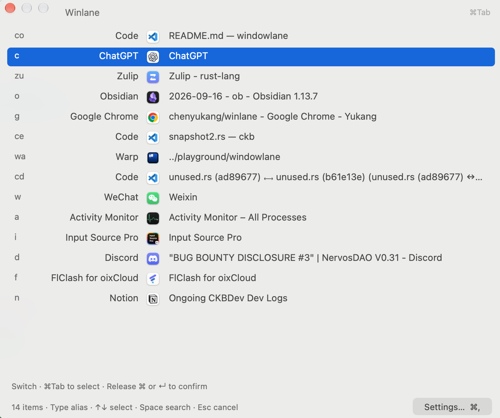

# Winlane

A native macOS window switcher, built with Rust and AppKit.

Hold a shortcut to move between windows, or type to find the one you need. Winlane runs in the menu bar and stays out of the way until you call it up.



## Get started

You need **macOS 14 or later**. Tagged builds are distributed through [GitHub Releases](https://github.com/chenyukang/winlane/releases) as a DMG or ZIP:

- **arm64** for Apple Silicon Macs.
- **x86_64** for Intel Macs.

Open the DMG and drag Winlane to Applications, or extract the ZIP and move `Winlane.app` there. Quit an existing copy before replacing it, and keep the same installation location for updates. Each release includes SHA-256 checksums and its signing status.

If a release is marked **not notarized**, macOS may block the first launch. After verifying the download, use **System Settings → Privacy & Security → Open Anyway**. Releases using a persistent signing certificate keep their identity across updates. Moving from an older ad hoc build to these releases may require granting Accessibility permission once more. See [signing and notarization](docs/releasing.md#signing-and-notarization) for details.

### Build from source

Install a Rust toolchain and Xcode Command Line Tools.

First, [set up a code-signing identity](docs/development.md#development-signing). Keeping the same identity lets development builds retain their Accessibility permission.

```sh
git clone https://github.com/chenyukang/winlane.git
cd winlane
./scripts/build-app.sh
```

The script builds a release version at `dist/Winlane.app`. Quit any running copy, copy the app to `~/Applications/Winlane.app`, and open it. Use this same installation location for subsequent builds.

### Allow window access

Open **System Settings → Privacy & Security → Accessibility**, add the installed Winlane app, and enable access. On macOS 27, this pane is called **Device Control and Data Access**. Open Winlane's panel again after granting permission.

Once authorized, Winlane starts quietly in the menu bar. Its menu provides access to the window picker, settings, and Quit. Choose **Feedback…** to report a bug or request a feature on [GitHub Issues](https://github.com/chenyukang/winlane/issues).

### Stay up to date

Release builds use [Sparkle 2](https://sparkle-project.org/) to check for updates daily. Choose **Check for Updates…** from the menu bar to check immediately. Winlane asks before downloading an update, then offers to install it and relaunch. Turn daily checks off in **Settings → Startup** to check manually instead.

Versions without Sparkle need one manual installation of a Sparkle-enabled release. Local source builds disable updates by default so a release cannot replace your development build.

## Everyday use

### Switch without stopping to search

Hold **Command**, press **Tab** to open the switcher, then press Tab again or keep it held to move through the list. Release Command to switch to the selected window. Add Shift to move backward, or press Esc to cancel.

A quick press and release switches back without showing the panel. Hold the shortcut for 100 ms to see the list; adjust this delay in **Settings → Windows** (0 shows it immediately). Search always opens immediately.

Each row represents an independent window. Separate editor projects appear separately; VS Code entries show the project name first, as `project: file`. Browser tabs and background helpers do not become extra entries. On multiple displays, the same picker appears on every screen, with a shared selection.

The letters beside each window are its **alias**. Type those letters while holding Command, then release Command to jump directly to that window. Aliases are assigned automatically from English app names, stay unique across windows, and are remembered when Winlane restarts. Additional window aliases may change when the target app closes and creates new windows.

### Reopen a VS Code project

Search for **projects** or **vscode** and select **Open recent VS Code projects**. Browse recent folders and workspaces, filter by project name or path, then press Enter to open one in VS Code. This also works when the project has no open window or VS Code is not running. Press Esc to return to window search, or **Command + R** to refresh the projects. See [recent projects](docs/projects.md) for supported locations and caching.

### Open saved links

Save websites, app links, and folders in **Settings → Quicklinks**, or import a Raycast Quicklinks JSON export. Find them by name in search, or select **quicklink** to browse only links. Matching windows retain priority. Templates such as `https://example.com/search?q={Query}` show parameter fields inside the search panel; `{clipboard}` uses copied text. See [Quicklinks](docs/quicklinks.md) for placeholders and import details.

### Reuse text with snippets

Create plain-text snippets in **Settings → Snippets**. Valid edits save automatically. Search for **snippet** and select the command to browse or search your snippets, then press Enter to paste into the app you were using before opening Winlane. Press Esc to return to window search; snippets stay out of ordinary window results.

Use **Insert Placeholder** for clipboard text, date presets with live previews, or custom text, multiline and dropdown fields. Configure defaults and required fields in Settings, then fill them in before pasting. See [snippet placeholders and examples](docs/snippets.md).

### Find something you copied earlier

Search for **clipboard** and select the command to browse your text and image history. Search its content or source app, then press Enter to paste into the previous app. **Command + C** copies only; **Command + Backspace** deletes an entry. History stays separate from ordinary window searches.

By default, Winlane keeps up to **200 entries for 7 days**, saved locally across restarts. Adjust retention, pause recording, disable disk storage, or clear history in **Settings → Clipboard**. Text, links and PNG/TIFF images are supported. Images show thumbnails and paste as images; file copies are not retained. See [clipboard history](docs/clipboard.md) for controls, storage and privacy details.

### Keep aliases for your apps and projects

Open **Settings → Aliases → Alias Rules**. Choose an app and assign one or two lowercase letters. Leave the title field empty for an app alias, or enter a case-insensitive title keyword such as `ckb` to target that project window. Rules save automatically; duplicate aliases are rejected.

Custom aliases take priority over automatic ones and are reserved even when their target is closed. Project rules follow matching window titles after the app or Winlane restarts. More specific title rules win; if several windows match one rule, one receives the fixed alias and the others keep distinct automatic aliases. Removing a rule restores automatic assignment. App aliases can also find unlaunched apps in search; project rules only match existing windows.

### Search when you know what you want

Press **Control + I** to open search. Type an app name, a window title, an alias, or a few keywords. Use the arrow keys to select a result and Enter to open it. Change the shortcut in **Settings → Shortcuts**; updates keep your saved bindings.

**Command + Space** is also supported for search. If Spotlight or another launcher already uses it, reassign that application's shortcut to avoid a conflict. Press the search shortcut again to dismiss the picker; releasing Command leaves search open.

With Recent sorting, full app names come first, then partial app names, then direct title matches, and finally fuzzy matches. Direct-match groups keep their window recency. Fuzzy results favor fewer spelling errors and closer character matches, with recent use breaking ties. An exact window alias puts that window first, followed by other windows from the same app. Other text matches remain available, even when a saved alias has no open window.

Search also tolerates misspelled words in app names and window titles: `chorme` finds Chrome and `fibre` finds a `fiber` project. Words of 4–7 characters allow one edit; longer words allow two, including adjacent letter swaps. Short inputs keep their usual alias, prefix, and abbreviation matching. The same spelling tolerance applies to installed apps you can launch.

An empty search shows existing windows. Once you type, matching installed apps also appear with a **↗ Launch app** label, so you can open an app that is not running yet. Apps that already have windows are not repeated as launch results.

You can also run commands from search: **lock-screen**, **sleep**, **mission-control**, **show-menu**, and **screenshot**. Type a command name or a keyword such as **lock**, **mission control**, or **菜单栏**, then press Enter to run it. Commands use a **>_** badge and appear only when your search matches them. `mission-control` opens the macOS overview so you can choose a window or desktop. `show-menu` moves the pointer to the display's top edge to reveal the whole menu bar without changing auto-hide settings. `screenshot` lets you drag to select an area and copies the image to the clipboard; Esc cancels. See [built-in commands](docs/commands.md) for details and how to add more.

Press **Space** in the switcher to start searching. In an empty search field, Space returns to switching; with text already entered, it remains a normal space. Input-method composition keeps its usual keyboard behavior.

### Give frequent apps a permanent shortcut

Open **Settings → Shortcuts → App Shortcuts**, choose an app, and assign a combination such as **Command + 1** for your browser or **Command + 2** for chat. Valid bindings save and take effect automatically.

These shortcuts work without opening the picker and launch the app if needed. They target an application; use a window's alias when you need a particular project or document. A global binding overrides the same combination in other apps—for example, a browser's numbered-tab shortcut.

## Make it yours

Open Settings from the menu bar or press **Command + ,** while using Winlane. Press **Esc** to close the current settings window, including App Shortcuts and Alias Rules. While composing text with an input method, Esc keeps its normal cancellation behavior.

| Settings tab | What you can change |
| --- | --- |
| **Shortcuts** | Separate shortcuts for search and switching, plus fixed app shortcuts. |
| **Appearance** | System, light, or dark appearance; Compact or Normal display density; background opacity; language; a toggle for footer hints, refresh status, and the Settings button. |
| **Input** | Start searches in English (default) or Chinese, keep the current input source, or remember the last input source used in Winlane. |
| **Windows** | Sorting, minimized windows, and apps to exclude. Recent sorting follows window focus, including mouse, Dock, and shortcut switches. |
| **Snippets** | Saved text and dynamic placeholders. |
| **Clipboard** | Recording, local storage, retention limits, and clearing history. |
| **Quicklinks** | Saved URLs and paths, input placeholders, target apps, and Raycast JSON import. |
| **Aliases** | Fixed letters for apps or project windows matched by title. |
| **Startup** | Launch at login, daily update checks, and Check for Updates. |

Settings save automatically. Menus, switches, and sliders apply immediately; text fields save when you press Return or finish editing. Invalid values and conflicting shortcuts leave the last valid configuration in effect and show an error. Restore Defaults also applies immediately.

**Normal** is the default, with larger text, icons, and taller rows in both search and switch modes. Choose **Compact** for the original, space-saving list. Panel height still follows the result count, with longer lists scrolling within the available space. Updates preserve your saved density choice.

Language changes update the interface without a restart. By default, Winlane uses the first supported language in your macOS preferences, falling back to English.

The input preference applies when the search field gains focus, including when you press Space from switch mode. The default is **Always English**. English and Chinese use an enabled input source chosen by macOS; if it is unavailable, the current source is kept. **Last used in Winlane** remembers your search input source across restarts and keeps the current source when there is no available saved source. Updates preserve your saved preference. You can still switch input sources manually while typing. Switch-mode aliases work independently of this setting.

The **Window** menu lets you limit searches to the current app, minimize or restore a window, hide its app, and copy its title. **Command + R** refreshes the list if something looks out of date.

## Privacy and permissions

Winlane uses Accessibility access to read and control windows, and a keyboard event filter to handle its shortcuts. It does not log keystrokes, take screenshots automatically, or send window data to a server. The explicit `screenshot` command captures only the area you select and places the image on your clipboard.

Settings, aliases and snippet templates are stored locally. Filled-in snippet arguments are not saved. Pasting a snippet writes its expanded plain text to the clipboard. Window titles, search terms, and selection history stay in memory and are discarded when Winlane quits. Copying a window title explicitly places it on the clipboard. Clipboard history records new text and image copies locally without encryption when enabled, with configurable retention. It skips standard sensitive-content markers and common password managers, but cannot detect every secret. See [clipboard privacy and storage](docs/clipboard.md#retention-and-privacy).

Update checks contact GitHub Releases for the update feed and packages. Sparkle system profiling is disabled; window titles and search terms are never included. Update feeds and downloads are verified with an embedded Ed25519 public key.

## Development

```sh
RUSTC_WRAPPER= cargo test --locked
RUSTC_WRAPPER= cargo clippy --locked --all-targets -- -D warnings
cargo fmt --all -- --check
```

CI runs formatting, Clippy, tests, and packaging checks on Apple Silicon and Intel macOS runners. See the [development guide](docs/development.md) for local signing and diagnostics, and the [release guide](docs/releasing.md) for binary distribution and Apple notarization.
